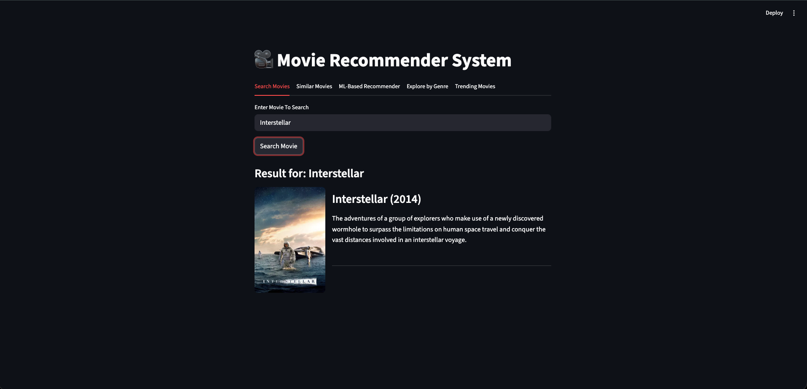
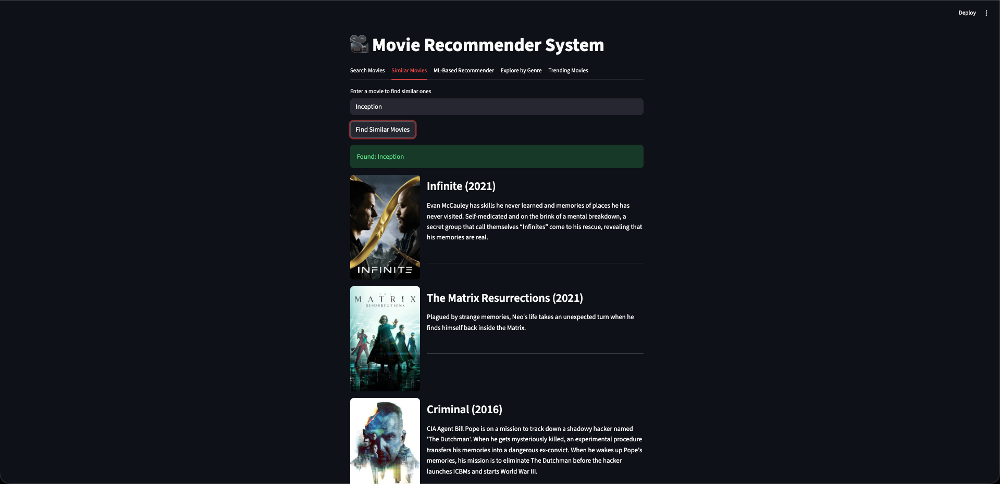
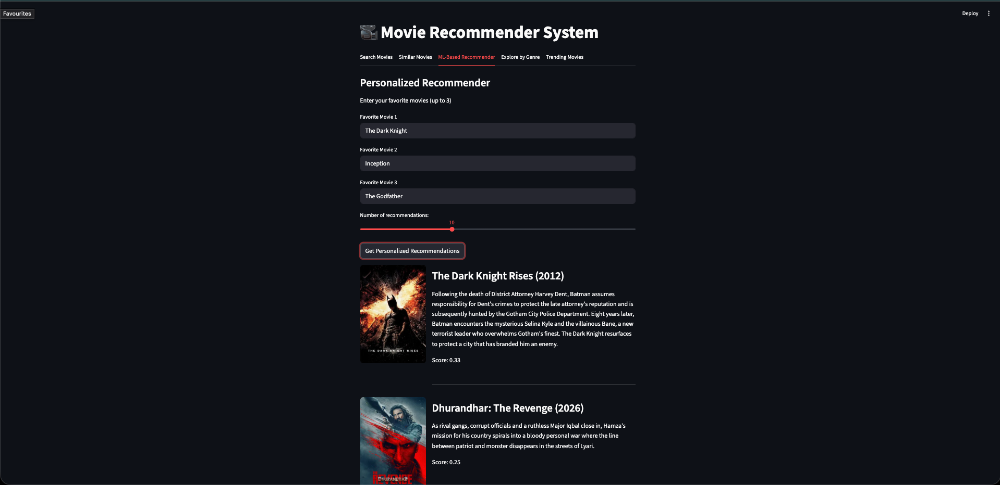
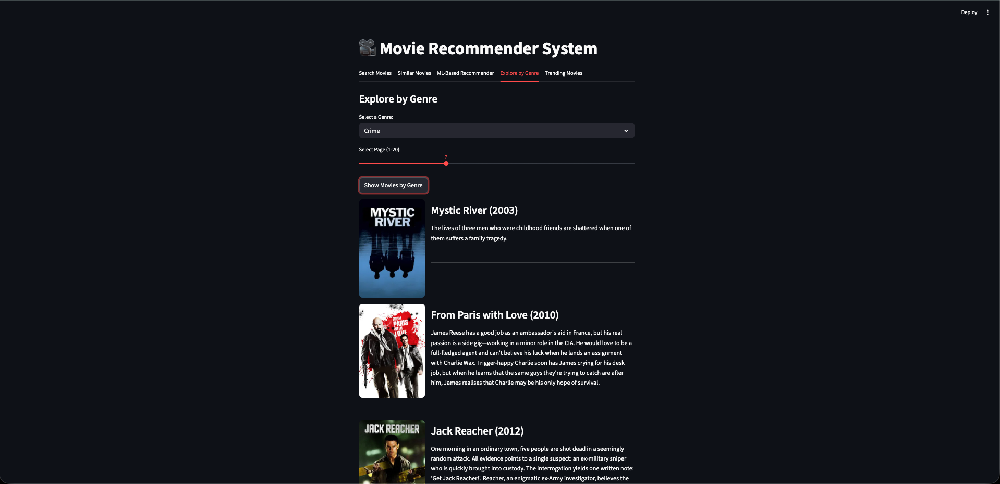
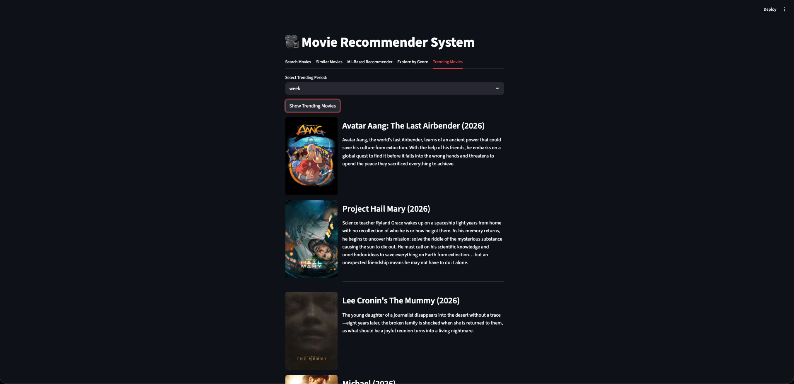

# Movie Recommender System

A content-based movie recommendation system built with **Python**, **Streamlit**, **scikit-learn**, and the **TMDB API**.  
The app allows users to search for movies, explore similar titles, browse by genre, view trending movies, and get personalized recommendations based on their favorite films.

## Features

- Search for a movie by title and view its details.
- Get similar movie recommendations using TMDB’s recommendation endpoint.
- Generate personalized recommendations from up to 3 favorite movies.
- Explore movies by genre.
- View trending movies by day or week.
- Display movie posters, release year, overview, and recommendation score.
- Cache API responses for faster performance and fewer repeated calls.
- Use retry logic and configurable timeouts for more reliable API requests.

## How the recommender works

The personalized recommender uses a **content-based filtering** approach with some ranking improvements:

1. The app searches TMDB for the user’s favorite movies.  
2. It extracts the genres of those favorites.  
3. It builds a candidate pool using:
   - movies fetched from liked genres,
   - optional expansion from TMDB similar-movie recommendations.
4. For each movie, it creates a text representation using:
   - title,
   - genres,
   - overview,
   - release year token.
5. It computes **TF-IDF vectors** for candidate movies and the user preference profile.
6. It ranks candidates using **cosine similarity**.
7. It applies a small **quality prior** using vote average and vote count.
8. It uses **MMR-style reranking** (Maximal Marginal Relevance) to improve diversity and reduce near-duplicate recommendations.

This helps the system balance:
- relevance,
- content similarity,
- catalog variety.

## Tech stack

- **Frontend / App UI:** Streamlit 
- **Backend logic:** Python 
- **ML / Ranking:** scikit-learn, NumPy 
- **API source:** TMDB API 
- **Configuration:** python-dotenv 
- **HTTP reliability:** requests + retry session

## Project structure

```bash
.
├── app.py            # Streamlit app UI
├── api.py            # TMDB API calls, caching, retries, session handling
├── recommender.py    # Recommendation pipeline and ranking logic
├── genre_utils.py    # Genre-based candidate fetching and diversification
├── config.py         # Environment variables, timeouts, retries, logging
└── README.md
```

## Installation

### 1. Clone the repository

```bash
git clone https://github.com/Vansh-Talwar/MovieRecommenderSystem.git
cd MovieRecommenderSystem
```

### 2. Create a virtual environment

```bash
python -m venv venv
```

Activate it:

**Windows**
```bash
venv\Scripts\activate
```

**Mac/Linux**
```bash
source venv/bin/activate
```

### 3. Install dependencies

```bash
pip install -r requirements.txt
```

## Environment setup

Create a `.env` file in the project root:

```env
TMDB_API=your_tmdb_api_key_here
TMDB_BASE_URL=https://api.themoviedb.org/3
CONNECT_TIMEOUT=3.05
READ_TIMEOUT=10
MAX_RETRIES=4
BACKOFF_FACTOR=0.5
RETRY_STATUS_CODES=429,500,502,503,504
DEBUG_MODE=False
```

You can get a TMDB API key from the TMDB developer portal.

## Run the app

```bash
streamlit run app.py
```

Then open the local URL shown in the terminal.

## App sections

### Search Movies
Search for a movie title and display its basic details such as poster, year, and overview.

### Similar Movies
Find a movie and retrieve similar titles using TMDB recommendations.

### ML-Based Recommender
Enter up to 3 favorite movies and receive personalized recommendations ranked using TF-IDF similarity, a quality prior, and diversity-aware reranking.

### Explore by Genre
Select a genre and browse movies from that category.

### Trending Movies
View trending movies for the day or the week.

## Why this project is interesting

This project goes beyond a basic movie search app by combining:

- API integration,
- caching and retry handling,
- content-based recommendation,
- feature engineering from movie metadata,
- reranking for diversity,
- an interactive user interface.

It is designed as an end-to-end ML application rather than just a notebook experiment.

## Future improvements

- Add unit tests for helper and recommendation functions.
- Add evaluation metrics for recommendation quality and diversity.
- Refactor API and UI concerns more cleanly.
- Support hybrid recommendations with collaborative filtering signals.
- Deploy the app publicly and add a live demo link.
- Add filters such as minimum rating, release year, or language.

## Screenshots
- Search Movie

- Similar Movie

- ML Based Recommender

- Explore By Genre

- Trending Movies



## Live demo

[Live App](https://vansh-movie-recommender-system.streamlit.app/)

## Resume-ready project summary

Built an end-to-end movie recommendation system using TMDB metadata, TF-IDF text features, cosine similarity, and MMR-style reranking, and deployed it as an interactive Streamlit application with caching, retries, and genre/trending discovery features.

## License

This project is for educational and portfolio use
